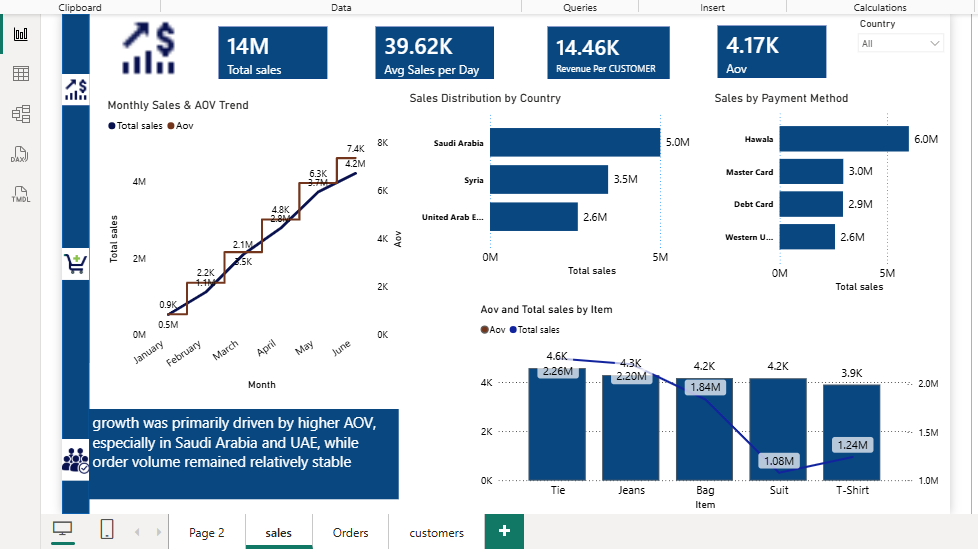
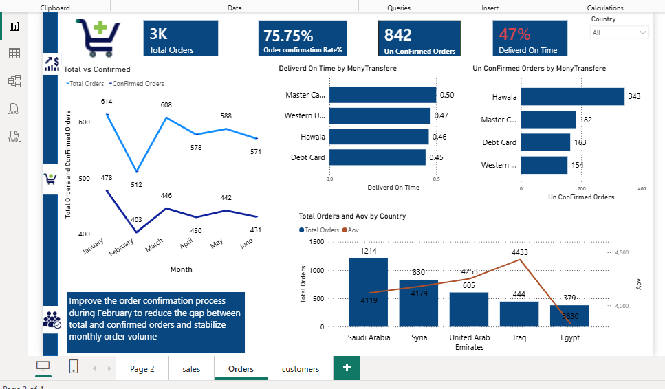
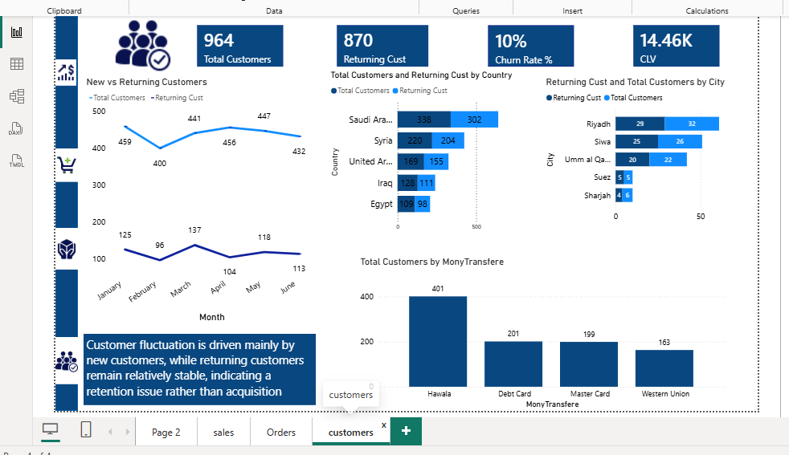

# Sales Analysis Dashboard | Power BI

## Project Overview

An interactive Power BI dashboard designed to analyze sales performance, customer behavior, and order operations across multiple countries and payment methods.

The project transforms raw sales data into actionable business insights through data cleaning, data modeling, DAX measures, KPI analysis, and interactive visualizations.

## Business Objectives

- Monitor overall sales and order performance.
- Analyze monthly sales and order trends.
- Evaluate order confirmation and delivery performance.
- Understand customer behavior and retention.
- Compare sales performance across countries and payment methods.
- Identify areas for operational improvement.

## Tools & Technologies

- Power BI
- DAX
- Power Query
- Data Cleaning
- Data Modeling
- Star Schema
- KPI Analysis
- Data Visualization

## Key KPIs

- Total Sales: 14M
- Average Sales per Day: 39.62K
- Average Order Value (AOV): 4.17K
- Revenue per Customer: 14.46K
- Total Orders: 3K
- Order Confirmation Rate: 75.75%
- Unconfirmed Orders: 842
- On-Time Delivery Rate: 47%
- Total Customers: 964
- Returning Customers: 870
- Churn Rate: 10%

## Key Insights

### Sales Performance

- Total sales reached approximately 14M.
- Monthly sales showed an overall upward trend from January to June.
- Saudi Arabia generated the highest sales among the analyzed countries.
- Hawala was the highest-performing payment method by total sales.

### Order Performance

- The overall order confirmation rate was 75.75%.
- February recorded a noticeable gap between total orders and confirmed orders.
- On-time delivery performance was below 50%, highlighting an opportunity to improve delivery operations.
- Hawala had the highest number of unconfirmed orders among the analyzed payment methods.

### Customer Analysis

- The dashboard tracks 964 total customers and 870 returning customers.
- Customer trends show fluctuations in new customers while returning customers remain relatively stable.
- Saudi Arabia had the highest customer count among the analyzed countries.

## Business Recommendations

- Improve the order confirmation process, particularly during periods with a large gap between total and confirmed orders.
- Investigate the main causes of late deliveries and improve delivery operations.
- Analyze unconfirmed orders by payment method to identify potential process issues.
- Focus on customer retention strategies to increase repeat purchases.
- Leverage high-performing countries and payment methods to support sales growth.

## Dashboard Screenshots

### Sales Dashboard

### Orders Dashboard

### Customers Dashboard

## Project Structure

- `sales-dashboard.png` — Sales analysis dashboard
- `orders-dashboard.png` — Orders analysis dashboard
- `customers-dashboard.png` — Customer analysis dashboard
- `README.md` — Project documentation
